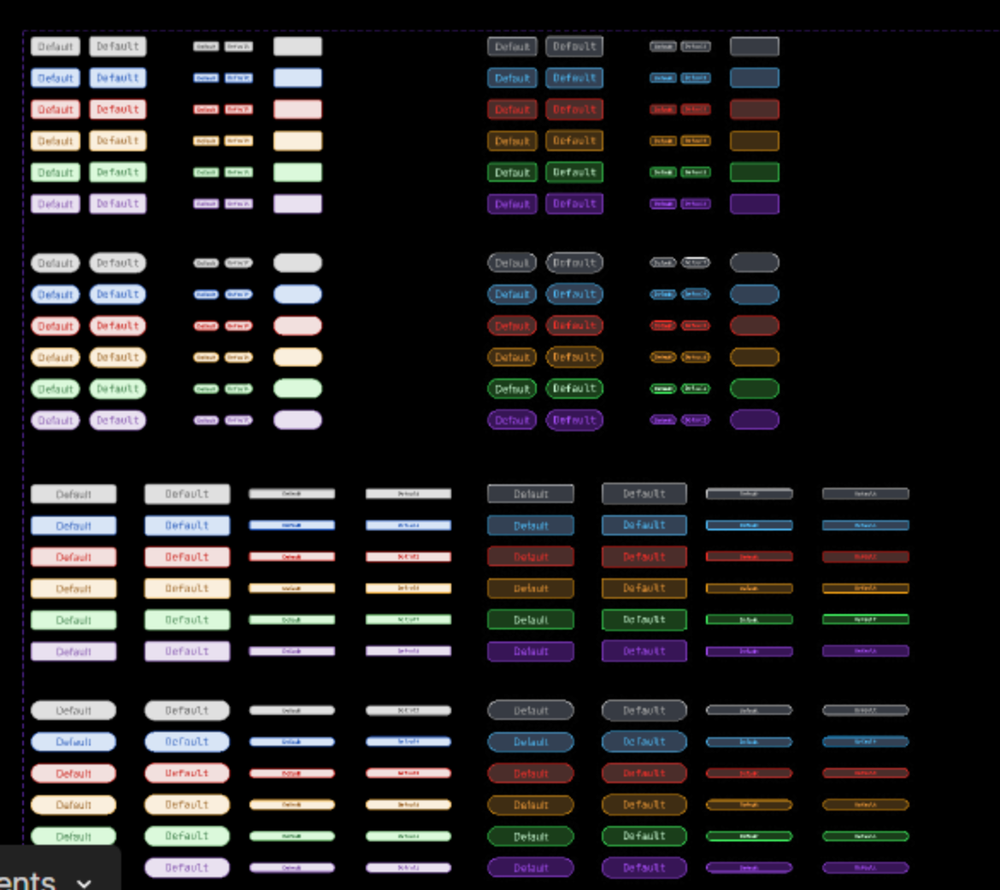
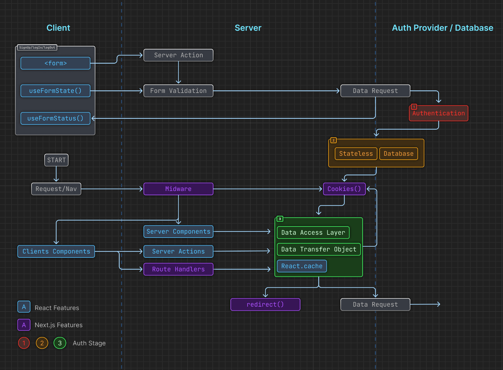
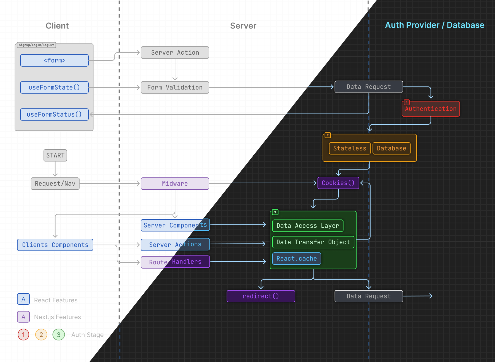

## Features

- Light mode
- Dark mode
- Multi-Node style
- Many Examples

## Figma Prototype

You can view the Figma prototype [here](https://www.figma.com/community/file/1375365743868413975).

## Preview

Here are some previews of the chart:

## Chart Kit

You can find the Chart Kit on our [wiki](https://github.com/Jackywine/JackywineDesignOpenSource/wiki/Chart-Kit).

## Pages

- [Home](#)
- [Chart Kit](https://github.com/Jackywine/JackywineDesignOpenSource/wiki/Chart-Kit)

You can also clone this wiki locally for offline use.
